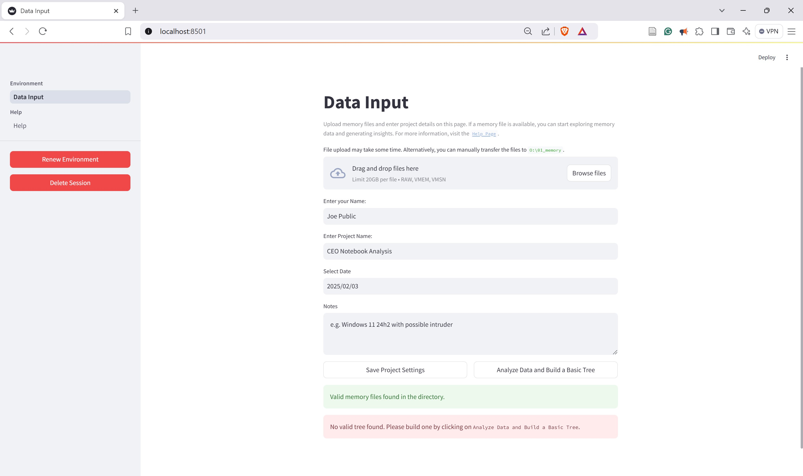
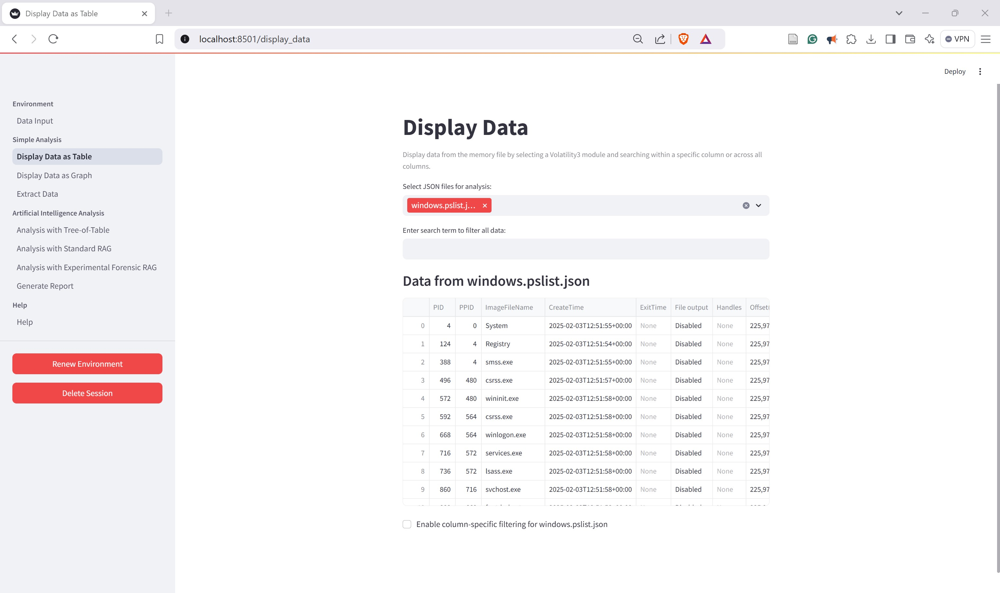
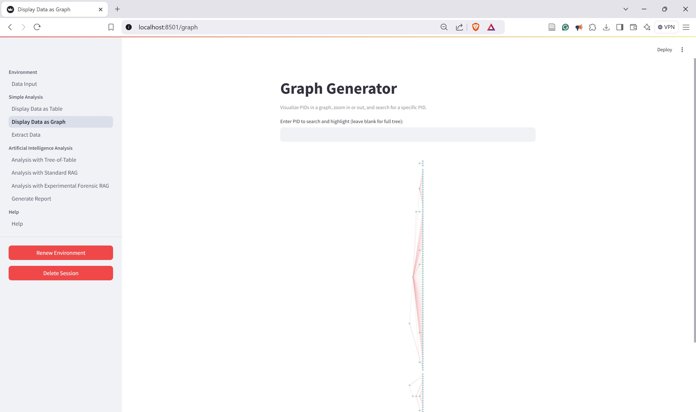
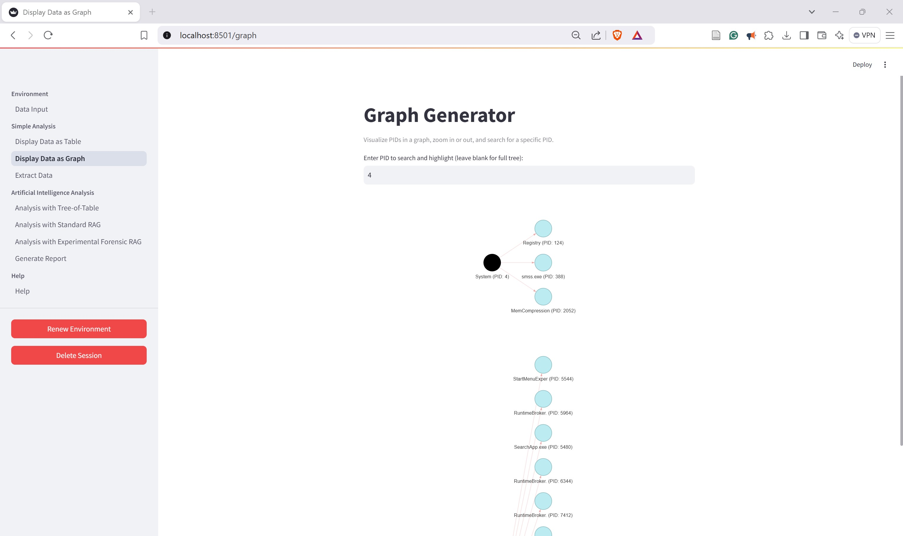
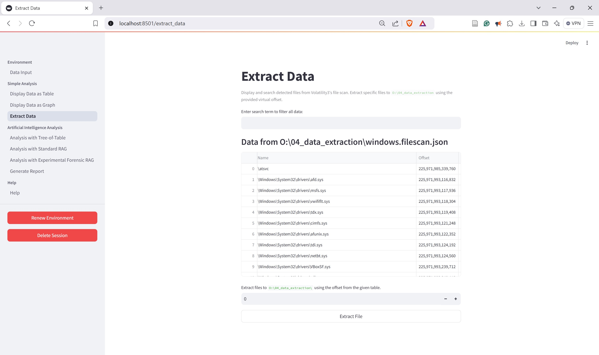
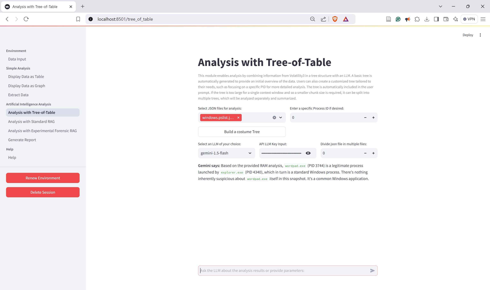
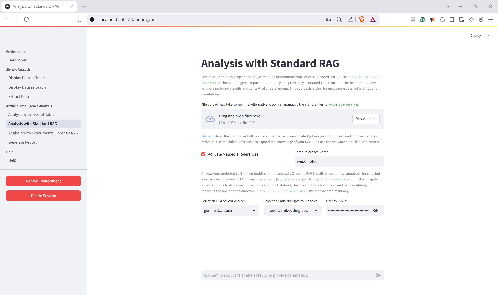
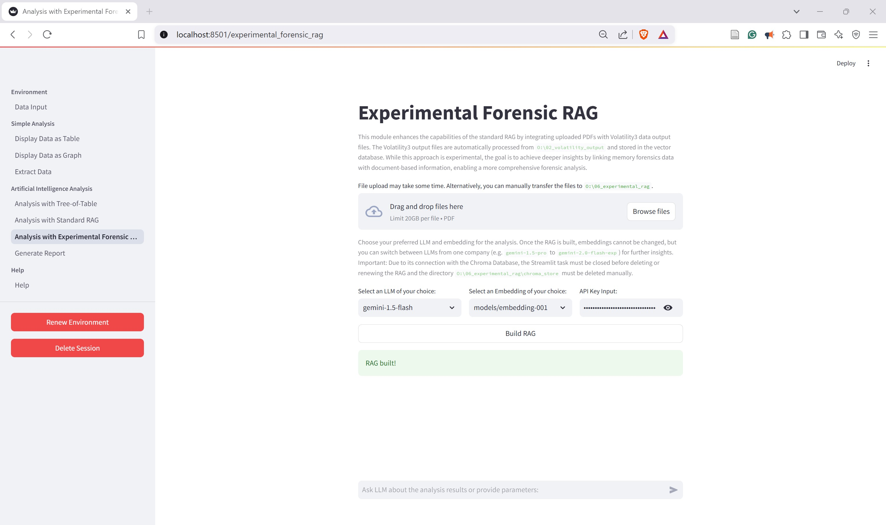
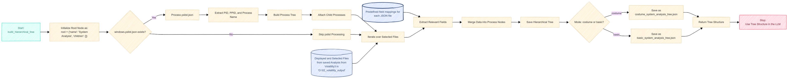

# Memory Investigator - Master Thesis Project

## Overview

Memory Investigator was developed as part of a master's thesis at the Munich University of Applied Sciences. It is a Streamlit-based application designed to automate memory forensic analysis. The tool integrates Volatility3 and Large Language Models (LLMs) including Retrieval-Augmented Generation (RAG) and an enhanced Tree-of-Table Algorithm. So the tool allows to dig deeper into the memory dump and therefore enhances efficiency and usability in memory forensics.

## Features

- **Automated Memory Analysis**: Uses Volatility3 to process memory dumps (`.raw`, `.vmem`, `.vmsn`) efficiently.
- **Tabular Data Representation**: Displays and allows searching of memory forensic findings.
- **Graphical Data Representation**: Displays process hierarchies as a graph and allows searching for specific PIDs.
- **Tree-of-Table Algorithm**: Algorithm to organize structured data into a hierarchical Tree-of-Table format, optimizing it for AI analysis and improved interpretability.
- **AI-Enhanced Tree-of-Table Analysis**: Integrates LLMs (`Google Gemini Models`, `OpenAI Models`) to provide forensic insights on the given Tree-of-Table.
- **AI-Enhanced RAG and Tree-of-Table Analysis**: Dynamically builds a Retrieval-Augmented Generation (RAG) model using provided data (e.g., `.pdf` files like books or threat intelligence reports and Malpedia Reports) to enhance forensic insights on the given Tree-of-Table.
- **AI-Enhanced Experimental Forensic RAG Analysis**: Dynamically builds a Retrieval-Augmented Generation (RAG) model from external sources (e.g., books or threat intelligence reports) combined with Volatility3-analyzed data for deeper forensic insights.
- **LLM and Embedding Choice**: Choose between `Google Gemini Models` and `OpenAI Models` as the appropriate LLM and Embedding for your task.
- **Structured Report Generation**: Uses an LLM to generate forensic reports.
- **User-Friendly Interface**: Simplifies forensic analysis for experts and newcomers.

## Installation

### Prerequisites

- Windows 10 or higher
- Stable Version with Python 3.11.9 (`python --version`)
- [Download Python Releases for Windows](https://www.python.org/downloads/windows/)
- Internet connection for Volatility3 downloads and LLM API interactions
- Google Gemini or OpenAI API Key

### Setup

1. Clone the repository:
   ```sh
   git clone https://github.com/jan-hendrik-lang/MemoryInvestigator.git
   cd MemoryInvestigator
   ```
2. Install required dependencies:
   ```sh
   pip install -r requirements.txt
   ```
3. Start the Streamlit application:
   ```sh
   streamlit run .\main.py
   ```

## Background Processes and Individual Configuration

### 1. Background Startup Process

- **Virtual Drive Initialization:** A temporary drive O: is created to store forensic tools and data.
- **Volatility3 Download:** Volatility3 is downloaded.
- **Dependencies Uninstallation:** For a clean Volatility3 installation, an old Yara is uninstalled beforehand.
- **Dependencies Installation:** Necessary Python packages and Volatility plugins are installed.

### 2. Folder Structure

The following folder structure in `O:` is created automatically.

```
O:\
├── 00_tools\              # Volatility3 and dependencies
├── 01_memory\             # Uploaded memory dumps
├── 02_volatility_output\  # Forensic output files
├── 03_trees\              # Process trees
├── 04_data_extraction\    # Extracted artifacts
├── 05_standard_rag\       # Standard AI-assisted analysis
├── 06_experimental_rag\   # Advanced AI-assisted analysis
├── 07_help\               # Documentation
```

### 3. Streamlit Configuration

To extend the capabilities of Streamlit (e.g. displaying debug message, or increasing the upload file size), create a `.streamlit` folder in the `MemoryInvestigator` directory with a `config.toml` file containing the following sample configuration.

```sh
[client]
showErrorDetails = false

[logger]
level = "debug"
messageFormat = "%(asctime)s %(message)s"

[server]
maxUploadSize = 20000
```

## Usage

### 1. Data Input

Upload memory dump files (`.raw`, `.vmem`, `.vmsn`) and provide project details. The upload could take a while, alternatively files can be transferred manually to `O:\01_memory`. This is especially recommended for large files. Do not upload more than one memory dump (expecting a `.vmem` could require a corresponding `.vmsn` File). If a requirement is not fulfilled (e.g. missing memory dump) not all pages or buttons will be available.



### 2. Button: Analyze Data and Build a Basic Tree

After a valid memory dump was uploaded to `O:\01_memory` the button `Analyze Data and Build a Basic Tree` will be available. By pressing this Button the script `\utils\volatility_analysis.py` starts. Now Volatility3 starts for the deep memory analysis by executing multiple forensic plugins and outputting `.json` files:
- **Process Analysis:** `windows.pslist`, `windows.svcscan`, `windows.cmdline`, `windows.dlllist`, `windows.getsids`
- **Network Investigation:** `windows.netstat`, `windows.netscan`
- **Malware Detection:** `windows.malfind`, `windows.suspicious_threads`, `windows.ldrmodules`, `windows.processghosting`, `windows.hollowprocesses`
- **Service Investigation:** `windows.svcscan`, `windows.svcdiff`
- **File Analysis:** `windows.filescan` 

After the Volatility3 analysis is finished, the script `\utils\tree_builder.py` starts. It builds a basic tree out of the `PID`, `PPID`, `ImageFileName`, `CreateTime`, `ExitTime`. Further described below in the Section Tree-of-Table Algorithm.

### 2. Display Data as a Table

Visualize memory artifacts in a structured table and search them column wide or column specific as well.



### 3. Display Data as a Graph

Visualize process hierarchies as a graph.



Also search the graph and zoom in or out.



### 4. Extract Data

Extract specific files from the memory dump to analyze these files deeper e.g. with file hashing, static or dynamic malware analysis. Files are extracted with the `windows.dumpfiles` Volatility3 module, specifying the virtual address.



### 5. Tree-of-Table Analysis

Interact with the selected LLM and an already created basic Tree-of-Table (`O:\03_trees\basic_system_analysis_tree.json`), or build a custom Tree-of-Table (`O:\03_trees\costume_system_analysis_tree.json`) out of multiple Volatility3 analysis. Also select only one PID (Process ID) for further investigation in this particular PID. The aim of this approach is to provide the LLM with more and more detailed information in a continuous process. Also divide the Tree-of-Table in multiple files for scalability and better handling of extensive datasets. For that a new Directory `O:\03_trees\temp` will be created temporarily.



### 6. Standard RAG
Retrieval Augmented Generation (RAG) is a powerful approach that enhances language models through the cooporation of external knowledge sources. RAG addresses a major limitation of models: they rely on static training datasets, potentially leading to outdated or inadequate information. When a query is received, RAG systems first search a knowledge base for relevant information. The system then coorporates this collected data into the model's prompt. The model uses the provided context to generate a response to the question. RAG is a powerful approach for developing more skilled and reliable AI systems by linking extensive language models with targeted information.<sup>[1]</sup> To build the RAG itself and the retrieval chat chain (`\utils\chat_handler.py`) the langchain framework is used.\
The script `\utils\build_rag_from_books.py` builds a RAG out of provided `.pdf` files (e.g. _The Art of Memory Forensics_ or _threat intelligence reports_) and a given reference name from Malpedia (e.g. `win.emotet`) combined with the script `\utils\get_malpedia_references.py`. Malpedia from the Fraunhofer FKIE is a collaborative malware knowledge base providing structured information about malware.<sup>[2]</sup>\
After building the RAG it uses the Tree-of-Table Algorithm to interact with the selected LLM. Even this approach supports the idea above, to provide the LLM with more and more detailed information to gather deeper insights to the memory dump. In this case with a user selection of e.g. the latest threat intelligence reports or threat intelligence reports that could fit to the attack vector of the memory dumps previous analysis.
Under the specification of a LLM and a associated Embedding the Chroma Vector Database will be permanently created in `O:\05_standard_rag\chroma_store`. Chroma is an open-source database for AI applications to create LLM applications by allowing specific data to be easily integrated into LLMs.<sup>[3]</sup>



### 7. Experimental Forensic RAG

This RAG does not only include prosa text like mentioned before, it also includes the Volatility3 files from `O:\02_volatility_output`. Here as well, after the specification of a LLM and an associated Embedding the Chroma Vector Database will be created. After the embedding of the `.pdf` files, the script `\utils\build_rag_from_books_and_volatility3_data.py` extends the mechanism from Section 6 with copying the Volatility3 Output to `O:\06_experimental_rag` and embedding it to the Choma Vector Store. The idea behind this method is to provide the user with an alternative model to provide the Volatility3 Output to the LLM.



### 8. Building a new RAG
If a RAG has been already built on `O:\05_standard_rag` or `O:\06_experimental_rag` and a new RAG should be built. The software must be stopped (e.g. by entering `CTRL + C`) and the folder `chroma_store` either in the directory `O:\05_standard_rag` or `O:\06_experimental_rag` must be deleted manually. 
This could be implemented in a specific button as well, but a prerequisite is to close the streamlit process so that no connection is ongoing to the chroma_store. And because of the deep interventions in the operating system, we decided against this step and left it up to the user.

### 9. Quit Session

- **Renew Environment**: All elements in Drive O: will be deleted and a new setup. 
- **Delete Session**: The Drive O: is deleted, the page closed and the streamlit process itself terminated.

## Tree-of-Table Algorithm
Providing large-scale tabular data, to LLMs is a challenge. LLMs were mainly designed for prose files, which is why even providing the `windows.pslist` causes too high tokens in the context window.
For that Ji et al. introduced Tree-of-Table, which employs a hierarchical tree structure <sup>[4]</sup> The Algorithm follows multiple steps and is implemented in this manner:
1. **Table Condensation and Decomposition:** Firstly, the large table must be divided into task relevant parts to focus on pertinent information. For that, in `\utils\tree_builder.py` the `field_mapping` describes relevant fields in the produced output from Volatility3. For an initial overview of the memory dump, a basic tree is built. After that, the user can specify relevant Volatility3 modules with predefined fields and, if necessary a PID, to build a custom tree and thus to provide the LLM with more and more detailed information in a continuous process.
2. **Table-Tree Construction:** Ji et al. employed a "breadth-first" approach. They broke down the issue into multiple general, independent yet interconnected subprocesses and subsequently refined each subprocess into more detailed solutions through iteration. In our approach, this step is easier because every Process has his unique ID `(PID)` by default and can be connected via the Parents Process ID `(PPID)`. So even each executed Volatility3 Modul has a containing PID and can therefore be added to this particular process. One possibility remains, a process could be exited but e.g. the network traffic remains without a `PID` in the memory dump. If something like this happens, these artifacts will be added to the end of the tree.
3. **Table-Tree Execution:** Lastly, Ji et al. utilize the Table-Tree execution as a depth-first search technique to methodically explore and calculate intermediate results within the tree framework, improving reasoning efficiency by handling and retaining subtrees separately. In our approach, this is done manually by the user. As mentioned before, the user is able to build custom trees and therefore provide it with more and more detailed information in a continuous process.



<details>
  <summary>E.g. Excerpt of a basic-build Tree</summary>

```
{
    "name": "System Analysis",
    "children": [
        {
            "name": "Processes",
            "children": [
                {
                    "name": "System",
                    "pid": 4,
                    "ppid": 0,
                    "children": [
                        {
                            "name": "Registry",
                            "pid": 92,
                            "ppid": 4,
                            "children": []
                        },
                        {
                            "name": "smss.exe",
                            "pid": 328,
                            "ppid": 4,
                            "children": []
                        },
                        {
                            "name": "MemCompression",
                            "pid": 1848,
                            "ppid": 4,
                            "children": []
                        }
                    ]
                }
            ]
        }
    ]
}

```
</details>

<details>
  <summary>E.g. Excerpt of a custom-build Tree</summary>

```
{
    "name": "System Analysis",
    "children": [
        {
            "name": "Processes",
            "children": [
                {
                    "name": "System",
                    "pid": 4,
                    "ppid": 0,
                    "SID": [
                        "S-1-5-18",
                        "S-1-5-32-544",
                        "S-1-1-0",
                        "S-1-5-11",
                        "S-1-16-16384"
                    ],
                    "ldrmodules": {
                        "InInit": false,
                        "InLoad": false,
                        "InMem": false,
                        "MappedPath": "\\Windows\\System32\\ntdll.dll"
                    },
                    "netscan": {
                        "Created": "2023-06-02T17:45:43+00:00",
                        "Owner": "System",
                        "Proto": "UDPv4",
                        "LocalAddr": "192.168.10.210",
                        "LocalPort": 137,
                        "ForeignAddr": "*",
                        "ForeignPort": 0,
                        "State": "LISTENING"
                    },
                    "netstat": {
                        "Created": "2023-06-02T17:45:43+00:00",
                        "Owner": "System",
                        "Proto": "UDPv4",
                        "LocalAddr": "192.168.10.210",
                        "LocalPort": 138,
                        "ForeignAddr": "*",
                        "ForeignPort": 0,
                        "State": "LISTENING"
                    }
                }
            ]
        }
    ]
}
```

</details>

Besides the Tree-of-Table approach, different methods for providing the appropriate information were tested. One approach was to provide the LLM schema information of tables and make the SQL database available to the LLM as a tool. Based on the users questions the LLM writes SQL-Statements directly to the database to provide itself with the information it needed. Unfortunately, the LLM made huge mistakes writing the SQL-Statements and most of the time the approach ended without any solution for the questions about the memory dump. Li et al. also came to these conclusions.<sup>[5]</sup> The task is even more difficult, as the LLM is not simply supposed to create SQL statements for specific SQL tasks, but must interpret the correct table from a question with, for example, known attack patterns. 
Another approach was that a finetuned LLM uses Volatility3 as a tool and self-driven creates commands to get specific information out of the memory dump. But also here the LLM could not create correct commands also due to the afore-mentioned problems.
At last, we implemented RAG not only to provide prose text but also to provide data. This approach is described in Section 7: Experimental Forensic RAG in more detail.

## API Keys

To use AI-assisted analysis (`api_llm_key`), provide valid API keys for Google Gemini or OpenAI in the Software, if asked.
- [Get a Gemini API key](https://ai.google.dev/gemini-api/docs/api-key)
- [OpenAI Developer Platform](https://platform.openai.com/docs/overview)

## Master Thesis Research Results
The Research Question for this master thesis was, if the automation of Volatility3 in combination with a Large Language Model can be used as a proof of concept to make queries in memory forensics more efficient and user-friendly. After doing a structured literature review and developing this software, multiple tests were executed. As mentioned in the paper _"volGPT: Evaluation on triaging ransomware process in memory forensics with Large Language Model"_ by Oh et al., they demonstrated how `pslist`, `vadinfo`, and `malfind` from Volatility 2.5.2 were automated and transmitted to the GPT-3.5 API through prompt engineering. This allowed them to successfully perform triage on ransomware-infected memory. <sup>[6]</sup> \
So it proved that through prompt engineering with a small amount of Volatility3 Output the detection of loud attacks, what a ransomware attack is, is possible. Our approach differs, because it no only utilizes a newer Volatiliy 3 Version 2.8.0 with more capabilities, but also uses newer and more LLMs with RAG intigration. Additionally, a Tree-of-Table Algorithm is used to provide selected, relevant and well-structured data. This section will be completed after full research results are available, but until now, the first attempts seems promising. 

## Ethics and other Challenges
The role of ethics in digital forensics and artificial intelligence is crucial. Here, the topic will only be briefly touched upon, but in the master's thesis, it will be covered in an individual chapter. The following considerations should always be kept in mind when using the software:

- **LLM's Hallucination**: Since LLMs rely on probabilistic text generation, they may generate facts, references, or conclusions that appear credible but are ultimately misleading or false. This poses a serious risk in forensic investigations, where accuracy is essential.
- **LLM's Privacy Risks**: Digital forensics often involves handling sensitive data. The LLM's provider could potentially use this information for model training or even industrial espionage.
- **LLM's Bias**: Misleading biases can arise due to incorrect prompts, flawed data, or confirmation bias.
- **EU AI Act**: The EU AI Act _(Regulation (EU) 2024/1689)_ sets guidelines for the development and use of AI within the EU. Research is not affected by the regulation. However, if the software is used in real-world applications, the level of risk depends on the user. If law enforcement is using it, there are additional strict regulations. If a company, such as a data center, deploys the software, the risk is limited and subject to fewer regulations.
- **Forensic Software in Court**: Due to reliability concerns and the fact that an LLM is a black-box system, it will be difficult - if not impossible - to use its output as evidence in court.

By acknowledging these ethical and technical challenges, users can better manage the risks through the following steps:

- **LLM's Hallucination**: Fact-checking the findings from the LLM in the generated .json file is indispensable.
- **LLM's Privacy Risks**: Given the size and capabilities of the major AI providers, avoiding their models is nearly impossible. These foundational technologies can now be applied easily in various scenarios without the need to build a custom LLM. However, a clear and well-defined contract with the chosen provider is essential.
- **LLM's Bias**: The quality of the prompt is crucial. Instead of leading questions, use objective prompts such as: "Analyze this process and determine whether an anomaly is present."
- **EU AI Act**: If the software is used by law enforcement or a company, always consult a trusted legal expert to ensure compliance.
- **Forensic Software in Court**: Besides fact-checking, a proper forensic process must be followed. This software should be regarded as an assistance tool, not as a standalone forensic solution.


## Further Development
- **Report-Generator:** Besides this master´s thesis, the report generator is expandable. E.g. bookmark important output for the LLM and combining it later in the report.
- **Interactive AI:** Actually the Software is a human-in-the-loop (HITL). These systems have limitations not only, but especially due to its reliance on human input (unpredictable, and erroneous). <sup>[7]</sup> In order to solve this problem, an LLM can execute external functions like calculators. This is to solve problems beyond typical LLM capabilities, like in this case calculating. In this particular Software the LLM could use the `\utils\tree_builder.py` in cooperation with `\utils\volatility_analysis.py` as a tool and generate his own needed data from the memory dump for a deep and a self-driven analysis.
- **Expand Experimental Forensic RAG with Malpedia:** Caused by the clearness, until now Malpedia with the WebBaseLoader is only implemented in the `Standard RAG`. Using `\utils\get_references_from_malpedia.py`, like `\utils\build_rag_from_books.py` in `\utils\build_rag_from_books_and_volatlity3.py` would expand the Experimental Forensic RAG with Malpedia.

## References 

[1] “Retrieval augmented generation (RAG) | 🦜️🔗 LangChain,” Langchain.com, 2024. https://python.langchain.com/docs/concepts/rag/ (accessed Feb. 05, 2025).\
[2] Plohmann, D., Clauss, M., Enders, S., Padilla, E. Malpedia: A Collaborative Effort to Inventorize the Malware Landscape. The Journal on Cybercrime & Digital Investigations, [S.l.], v. 3, n. 1, apr. 2018.\
[3] “Introduction - Chroma Docs,” Trychroma.com, 2025. https://docs.trychroma.com/docs/overview/introduction (accessed Feb. 05, 2025).\
[4] D. Ji et al., “Tree-of-Table: Unleashing the Power of LLMs for Enhanced Large-Scale Table Understanding,” 2024, arXiv. doi: 10.48550/ARXIV.2411.08516.\
[5] J. Li et al., “Can LLM Already Serve as A Database Interface? A BIg Bench for Large-Scale Database Grounded Text-to-SQLs,” 2023, arXiv. doi: 10.48550/ARXIV.2305.03111.\
[6] D. B. Oh, D. Kim, D. Kim, and H. K. Kim, “volGPT: Evaluation on triaging ransomware process in memory forensics with Large Language Model,” Forensic Science International: Digital Investigation, vol. 49. Elsevier BV, p. 301756, Jul. 2024. doi: 10.1016/j.fsidi.2024.301756.\
[7] R. Zhang et al., “Interactive AI With Retrieval-Augmented Generation for Next Generation Networking,” IEEE Network, vol. 38, no. 6. Institute of Electrical and Electronics Engineers (IEEE), pp. 414–424, Nov. 2024. doi: 10.1109/mnet.2024.3401159.\


## Contact

For inquiries or support, contact: [j.lang@hm.edu](mailto:j.lang@hm.edu)
